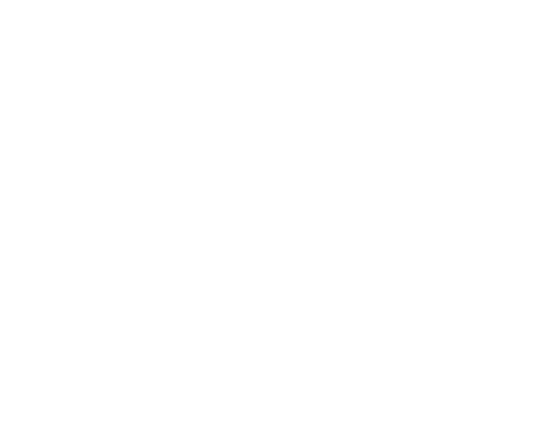

# Spain Electricity Price Tier Prediction

Predicts whether Spain's electricity price, **24 hours ahead**, will be **HIGH**, **MEDIUM**, or **LOW** — using only information genuinely knowable a day in advance. Simulates a real usage-planning tool: *"tomorrow afternoon looks expensive — shift your usage."*

This is a learning/portfolio project, scoped deliberately to practice feature engineering from time-series data and proper multi-class model evaluation — not a production deployment (see [Scope](#scope) below).

## Problem Statement

Electricity prices in liberalized EU markets like Spain's fluctuate hour to hour based on demand, generation mix, and grid conditions. A household or small business that could reliably anticipate *tomorrow's* cheap vs. expensive hours could shift flexible usage (laundry, EV charging, batch manufacturing) to save money — but raw hourly price data isn't actionable on its own.

This project reframes the problem as a **3-class classification task**: given what's known today, predict which price tier a given hour will fall into tomorrow.

## Data

- **Source:** [Spanish Energy Market dataset](https://github.com/alexanderparks/Spanish-Energy-Market-Prediction) — hourly electricity generation, demand, and price data for Spain, originally sourced from ENTSOE and Red Eléctrica de España.
- **Range:** January 1, 2015 – December 31, 2018 (35,064 hourly rows, zero timestamp gaps).
- **Target construction:** Prices were split into three **equal-sized tiers** (tertile binning) rather than round-number cutoffs, to guarantee a clean, fair 33.3% baseline:
  - LOW: ≤ €52.72/MWh
  - MEDIUM: €52.72 – €64.43/MWh
  - HIGH: > €64.43/MWh

A companion weather dataset (5 Spanish cities, 178k+ rows) was also tested — see [Methodology Decisions](#methodology-decisions).

## The Core Rule: No Lookahead Leakage

At any prediction point *T* (predicting the tier at *T+24 hours*), the model may only use:
- Price/load history from **at or before** time *T* (lags, rolling averages)
- Calendar facts about the *target* time itself (hour, day of week, month) — trivially known in advance
- Legitimate day-ahead published data (tested, see below)

Same-hour "actual" generation/load columns were **excluded entirely** — they aren't knowable 24 hours in advance and would silently leak future information into the model.

## Methodology Decisions

Several decisions were made deliberately, with reasoning — not defaults:

| Decision | Choice | Why |
|---|---|---|
| Missing values (36 rows, `total load actual`) | Linear interpolation | Compared against forward-fill and dropping on a real 6-hour gap; interpolation preserved the trend most faithfully |
| Weather features | **Dropped entirely** | Correlation with price was weak across all variables (temp 0.08, wind_speed −0.23, humidity −0.04, etc.). Also: a real product would need *forecast* weather, not the *observed* weather used here — using actuals would itself be a leakage risk in a live system |
| `price day ahead` column (0.74 correlation — strong, and *not* leakage) | **Deliberately excluded** | Legitimately available a day ahead, but including it would likely overshadow the hand-built lag features that are the actual learning objective of this project. Flagged as a natural first addition if this became a real product |
| Forecast columns (solar/wind day-ahead) | Dropped (weak/empty) | `forecast solar day ahead` (0.10) and `forecast wind onshore day ahead` (−0.22) were weak; `forecast wind offshore eday ahead` was 100% empty |
| `total load forecast` | **Kept** | Moderate, legitimate signal (0.44 correlation), genuinely available in advance |
| Train/test split | Chronological (train 2015–2017, test 2018) | A random shuffle would leak future information into training via adjacent-in-time rows — time-series data must be split by time, not randomly |
| Cross-validation | `TimeSeriesSplit`, 5 folds, expanding window | Never validates on data earlier than what it trained on; used only within the training years for model comparison — the 2018 holdout was touched exactly once, at the end |

**Final feature set (8 columns):** `hour`, `dayofweek`, `month`, `price_lag_24`, `price_lag_168`, `price_rollavg_24`, `price_rollavg_168`, `total load forecast`

## Models Compared

All models evaluated via 5-fold `TimeSeriesSplit` cross-validation on the training years only:

| Model | Mean CV Accuracy |
|---|---|
| Baseline (majority class) | 0.288 |
| Logistic Regression (scaled, in a Pipeline) | 0.688 |
| Decision Tree (max_depth=7) | 0.643 |
| **Random Forest (n_estimators=300, max_depth=7)** | **0.714** |
| XGBoost (early stopping) | 0.712 |

Random Forest and XGBoost were close enough (0.7144 vs. 0.7117) to warrant a direct tiebreak on identical folds: Random Forest won on **mean accuracy**, **fold-win count (3/5)**, and **lower variance (std 0.036 vs. 0.040)** — all three signals agreed, so it was selected as the final model. Further hyperparameter search was deliberately not pursued: the 0.27-point gap between the top two models is smaller than natural fold-to-fold noise (folds swing 5–9 points on their own), and this project's scope is learning-focused rather than leaderboard-chasing.

## Final Results (2018 holdout, checked once)

**Test accuracy: 0.74**

| Class | Precision | Recall | F1 | Support |
|---|---|---|---|---|
| LOW | 0.66 | 0.60 | 0.63 | 1,424 |
| MEDIUM | 0.56 | 0.66 | 0.60 | 2,576 |
| HIGH | 0.88 | 0.82 | 0.85 | 4,735 |

*(Generated in the notebook — see `notebook.ipynb`)*

**Key findings:**
- Nearly all errors are **neighbor confusions** (LOW↔MEDIUM, MEDIUM↔HIGH) — LOW↔HIGH mistakes are almost nonexistent (16 and 55 cases out of thousands). The model consistently understands tier *order*, even on its wrong predictions.
- **HIGH is the strongest, most actionable class** (precision 0.88, recall 0.82) — exactly the tier a real usage-planning tool would most need to get right.
- **MEDIUM is structurally the hardest class** — it's the only tier that can be confused from *both* directions (pulled toward LOW from below, HIGH from above), while LOW and HIGH each really only have one realistic neighbor. This is an inherent property of the 3-tier framing, not a modeling flaw.
- Test accuracy (0.74) came in slightly *above* the CV mean (0.7144) — a reassuring sign the model generalized to genuinely unseen 2018 data rather than overfitting to 2015–2017.
- Class support in the 2018 test set (1,424 / 2,576 / 4,735) is noticeably imbalanced despite the tiers being built equal-sized on 2015–2017 data — 2018 prices genuinely shifted upward relative to the fixed cutoffs, an honest artifact of using a fixed historical threshold on new data.

## Scope

**This project intentionally stops here.** Explicitly out of scope:
- Deployment (no FastAPI, no Docker, no live API)
- Neural networks (classical ML was sufficient and appropriate for this feature set/size)
- Using `price day ahead` or live weather forecasts (see Methodology Decisions)

**A real product version** would likely: include `price day ahead` as a feature, replace observed weather with a live forecast API, retrain periodically as price distributions shift (see the 2018 support imbalance above), and expose predictions via a simple API/dashboard.

## Tech Stack

Python, pandas, NumPy, scikit-learn (`Pipeline`, `TimeSeriesSplit`, `RandomForestClassifier`, `DecisionTreeClassifier`, `LogisticRegression`), XGBoost, matplotlib, seaborn.

## How to Run

1. Open `notebook.ipynb` in Google Colab or Jupyter
2. Run all cells top to bottom — data is downloaded automatically from the source repo
3. No API keys or local setup required
